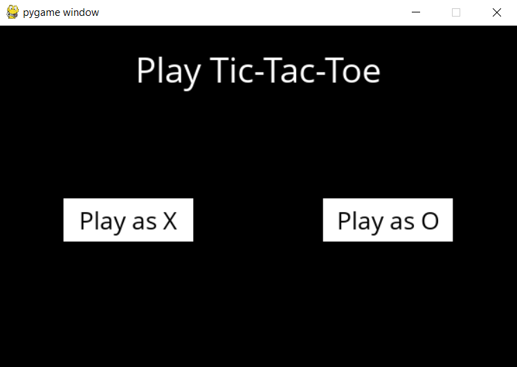
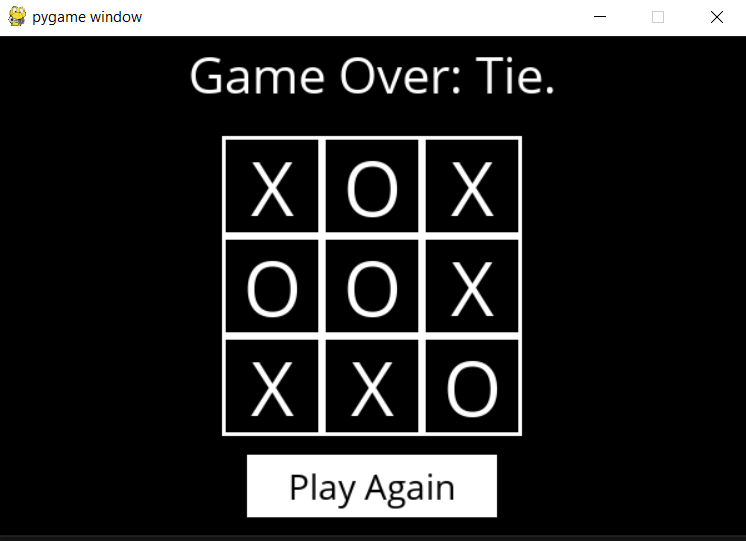

# Tic-Tac-Toe AI

This repository contains a Tic-Tac-Toe game with an AI opponent that uses the Minimax algorithm. The AI plays optimally and ensures that you can't beat it if you both make the best moves.

## Project Overview

This project consists of two main components:

- **tictactoe.py:** This module provides the core logic for the Tic-Tac-Toe game, including functions for checking the game state, determining the next move, and implementing the Minimax algorithm. Alpha-Beta Pruning is also implemented for more efficient AI decision-making.

- **runner.py:** This script uses the `pygame` library to create a graphical interface for the Tic-Tac-Toe game. It allows you to play against the AI and displays the game's status and results.

## Implementation Details

The AI and game logic are implemented in the `tictactoe.py` module. The following functions are implemented:

- `player(board)`: Determines which player's turn it is (either X or O).
- `actions(board)`: Returns a set of all possible actions on the board.
- `result(board, action)`: Returns a new board state after making a move.
- `winner(board)`: Determines the winner of the board (X, O, or None).
- `terminal(board)`: Checks if the game is over.
- `utility(board)`: Computes the utility of the board (1 for X, -1 for O, 0 for a tie).
- `minimax(board)`: Finds the optimal move for the AI using the Minimax algorithm with alpha-beta pruning.

## Screenshots

  
&nbsp; &nbsp; &nbsp; &nbsp;
  

## How to Play

- Run `python runner.py` to start the game.
- Choose to play as either X or O.
- Make your moves by clicking on the board.
- Try to win or tie against the AI!

Have fun playing Tic-Tac-Toe against the unbeatable AI!

------------

This repo is part of Harvard's CS50 AI studies.
